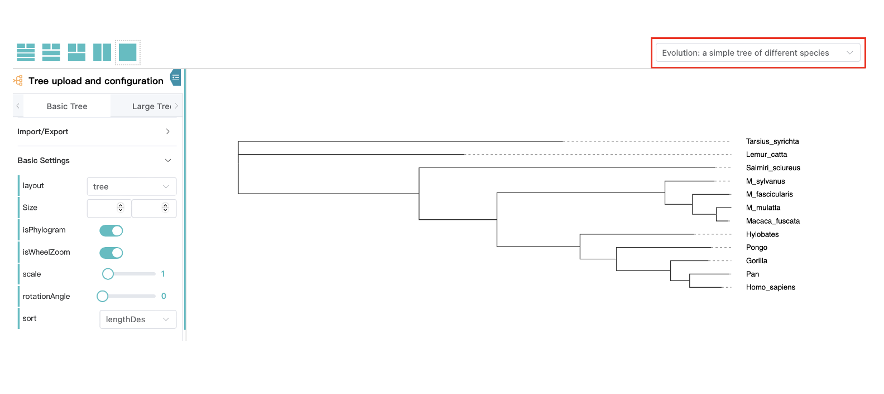
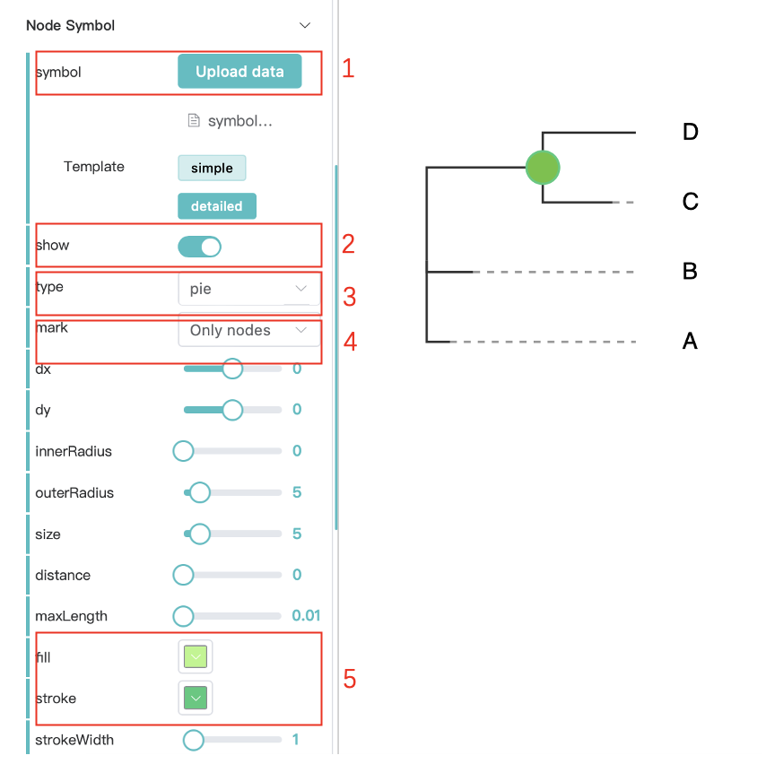
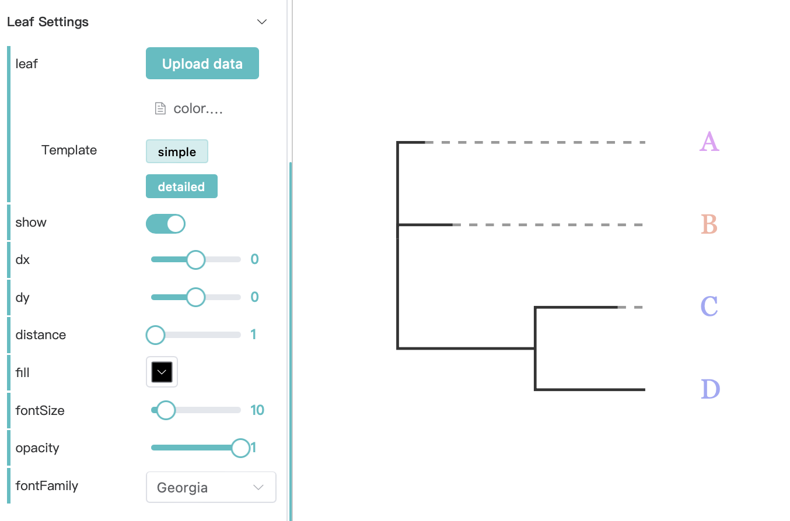
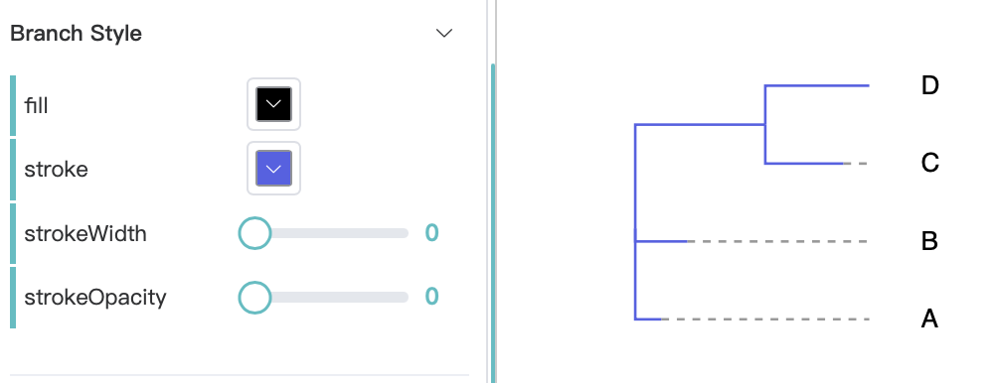
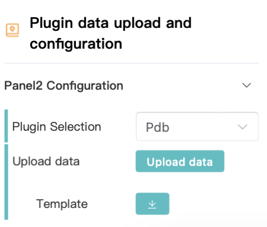

# PhyloScape web application documentation

## 1 Overview

[PhyloScape](http://darwintree.cn/PhyloScape/#/applicationone) web application is build with [PhyloScape JS library](https://github.com/zlluGitHub/PhyloScape).  This platform provides foundational support for phylogenetic tree visualization, including rendering large trees with millions of nodes. Through its plugin system, the platform integrates additional data layers such as geospatial information, statistical graphs, and protein structure details, enabling users to create and share customized tree visualizations.

## 2 Quick use

### 2.1  Using PhyloScape

To start using PhyloScape, simply click the `application` button on the page. To save or share your tree, please `Login`.


Then create a tree file with the extension of .nwk with:
```json
(A:0.1,B:0.2,(C:0.3,D:0.4)E:0.5)F;
```


To create and share a new tree, follow the steps:
1. Select a workspace panel
2. Upload or import a tree file
3. Customize the tree layout
4. Share your tree

After step 1 and 2, you will get:


To explore a demo:
a. Select a demo

> **Tip:** Check the top left corner of the application page for a simple animated, step-by-step tutorial.

### 2.2  Change the layout and size of the tree

After create a tree, you can change the layout and relative size of your tree.

Let's start with the demo file: Evolution: a simple tree of different species.


Set a width and height of your tree with the `Size` option.


Change your tree layout to radial using the `layout` option.


### 2.3  Show the node values

To show the values like bootstrap values or posterior probabilities, use the `Node Value` option.

Let's start with the tree file again:
```json
(A:0.1,B:0.2,(C:0.3,D:0.4)E:0.5)F;
```

Select the `show` button, you can add value to the tree branches. To only include the value on node, select the `Only nodes` with the `mark` option.


### 2.4  Add node symbol

To add a symbol to a tree node, use the `Node Symbol` option and then follow the steps.

Just start with the tree file:
```json
(A:0.1,B:0.2,(C:0.3,D:0.4)E:0.5)F;
```
1. Upload a symbol csv file (simple mode):
```json
id,class
E,C4
```
2. Click show button;
3. Select a type of symbol you like;
4. Choose only nodes for symbols on the nodes;
5. Use a favorate color.


### 2.5  Color your tree leaves
Start with the same tree file:
```json
(A:0.1,B:0.2,(C:0.3,D:0.4)E:0.5)F;
```

Upload a group file:
```json
id,group
A,C1
B,C2
C,C3
D,C3
```

Then you can get:


### 2.6  Tree leaf mask
Uplad a tree file.
```json
(A:0.1,B:0.2,(C:0.3,D:0.4)E:0.5)F;
```

And a group file.
```json
id,group
A,G1
B,G2
C,G3
D,G3
```

When the `show` botton is on, you can get:


### 2.7  Design your metadata
Let's start with the same tree.
```json
(A:0.1,B:0.2,(C:0.3,D:0.4)E:0.5)F;
```

For metadata information, use:
```json
id,group,class
A,G1,C1
B,G2,C2
C,G3,C3
D,G3,C4
```

After upload the metadata you can get:


> **Tip:** Check the detailed template for more complex design with metadata visualization.

### 2.8  Color tree branch

Let's start with the same tree.
```json
(A:0.1,B:0.2,(C:0.3,D:0.4)E:0.5)F;
```

At the branch style, change the color of stroke, then you can get:


### 2.9  Add a scale bar

To show a scale, set the `Scale bar` option.

Just start with the same tree.
```json
(A:0.1,B:0.2,(C:0.3,D:0.4)E:0.5)F;
```

Then turn on the `show` botton.


### 2.10  Add timeline

To add time line to a tree, follow the steps start with the tree:
```json
(A:0.1,B:0.2,(C:0.3,D:0.4)E:0.5)F;
```
1. turn on the show botton；
2. Select a timeline type, in this example, we use "Line".
3. add background line to the tree to make the timeline clearer.


### 2.11  Large tree visualiztion
We recommend visualizing trees with more than 10,000 nodes using the large tree mode. The large tree visualization feature is constructed using WebGL. To visualize a large tree, simply swith to the large tree mode.


## 3 Use with plugins
Several plugins are provided on the PhyloScape page at `Plugins`. Choose one and click `use` to start create a tree with different scenarios. For each plugin, a demo is included.

### 3.1 Protein structure view
We utilize a third-party developed library to visualize protein structures, i.e. The pdbe-molstar library of Mol* (/'mol-star/) (doi.org/10.1093/nar/gkab314).

Select the PDB plugin at the `Plugins` section, or select a workspace panel and choose the PDB plugin under `Plugin data upload and configuration`. 


Upload a tree file and compressed protein structure files (in .pdb format), and users can click on the leaf nodes to access protein structure information.


## 4 Share your tree
Authenticated users can generate links for sharing self-designed trees.

1. Create a link
Logged-in users can create a link for the current tree, and other users can directly access the tree through this link. Click the `share` button to share your tree.


2. View a link
Users can view the link at [Gallery](http://darwintree.cn/PhyloScape/#/gallery).


