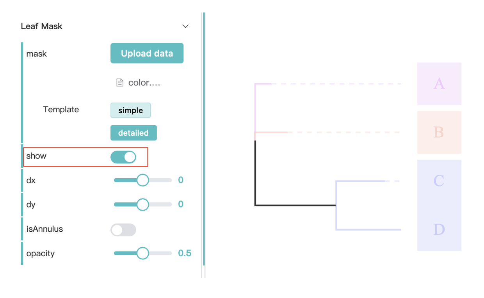
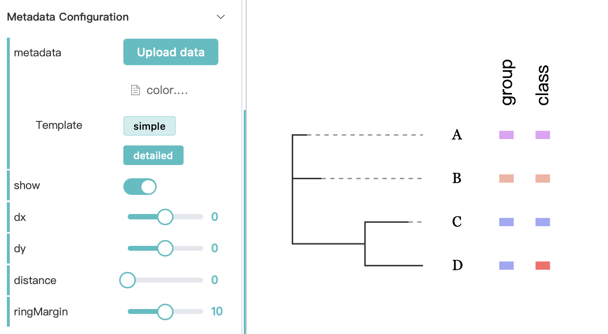
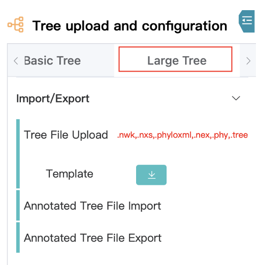
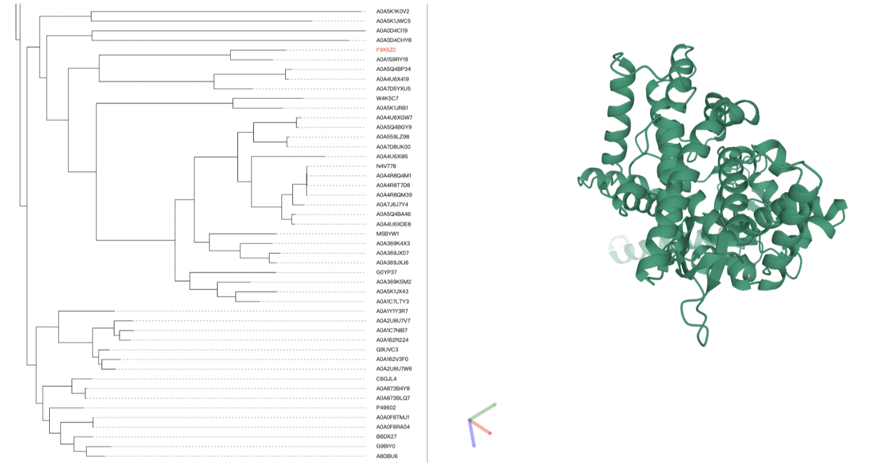

# PhyloScape Web 应用程序文档

## 1 概述

[PhyloScape](http://darwintree.cn/PhyloScape/#/applicationone) Web 应用程序基于 [PhyloScape JS 库](https://github.com/zlluGitHub/PhyloScape) 构建。该平台为系统发育树的可视化提供了基础支持，包括渲染拥有数百万节点的大型树。通过其插件系统，该平台整合了额外的数据层，例如地理空间信息、统计图表和蛋白质结构细节，使用户能够创建和分享定制化的进化树可视化内容。

## 2 快速使用

### 2.1 使用 PhyloScape

要开始使用 PhyloScape，只需点击页面上的 `application` 按钮。要保存或分享进化树，请先 `登录`。


使用.nwk文件创建新的树：
```json
(A:0.1,B:0.2,(C:0.3,D:0.4)E:0.5)F;
```


要创建并分享一棵新的树，请按照以下步骤操作：
1. 选择一个工作区面板
2. 上传或导入一棵树的文件
3. 自定义树的布局
4. 分享你的树

在完成步骤1和2之后，你将得到：


要探索一个示例：
a. 选择一个示例

> **提示：** 在应用程序页面的左上角查看一个简单的动画式分步教程。

### 2.2 更改树的布局和大小

创建树之后，可以更改树的布局和相对大小。

我们先从以下示例文件开始：
Evolution: a simple tree of different species.


通过`Size`选项设置长宽.


使用 `layout` 选项将你的树布局更改为放射状。


### 2.3 显示节点值

要显示诸如置信度值（bootstrap values）或后验概率（posterior probabilities）之类的值，请使用 `Node Value` 选项。

我们再次从树文件开始：
```json
(A:0.1,B:0.2,(C:0.3,D:0.4)E:0.5)F;
```

点击 `show` 按钮，可以为树的分支添加值。如果只想在节点上显示值，选择带有 `mark` 选项的 `Only nodes`。


### 2.4 添加节点符号

要向树节点添加符号，请使用 `Node Symbol` 选项，然后按照步骤操作。

从树文件开始：
```json
(A:0.1,B:0.2,(C:0.3,D:0.4)E:0.5)F;
```
1. 上传一个符号CSV文件（简单模式）：
```json
id,class
E,C4
```
2. 点击显示按钮；
3. 选择你喜欢的符号类型；
4. 仅选择节点上的符号；
5. 使用你喜欢的颜色。


### 2.5 为你的叶节点上色
从相同的树文件开始：
```json
(A:0.1,B:0.2,(C:0.3,D:0.4)E:0.5)F;
```

上传一个分组文件：
```json
id,group
A,C1
B,C2
C,C3
D,C3
```

然后你可以得到：


### 2.6 树叶遮罩
上传一个树文件。
```json
(A:0.1,B:0.2,(C:0.3,D:0.4)E:0.5)F;
```

以及一个分组文件。
```json
id,group
A,G1
B,G2
C,G3
D,G3
```

当点击`show`按钮时，你可以得到：


### 2.7 设计你的元数据
从相同的树开始。
```json
(A:0.1,B:0.2,(C:0.3,D:0.4)E:0.5)F;
```

对于元数据信息，使用：
```json
id,group,class
A,G1,C1
B,G2,C2
C,G3,C3
D,G3,C4
```

上传元数据后，你可以得到：


> **提示：** 查看详细模板，以了解如何使用元数据可视化进行更复杂的设计。

### 2.8 为树枝上色

从相同的树开始。
```json
(A:0.1,B:0.2,(C:0.3,D:0.4)E:0.5)F;
```

在树枝样式中，更改线条的颜色，然后你可以得到：


### 2.9 添加比例尺

要显示比例尺，请设置`Scale bar`选项。

从相同的树开始。
```json
(A:0.1,B:0.2,(C:0.3,D:0.4)E:0.5)F;
```

然后点击“显示”按钮。


### 2.10 添加时间线

要为树添加时间线，请按照以下步骤操作，从以下树开始：
```json
(A:0.1,B:0.2,(C:0.3,D:0.4)E:0.5)F;
```
1. 点击“show”按钮；
2. 选择时间线类型，在这个例子中，我们使用“Line”；
3. 为树添加背景线，使时间线更加清晰。


### 2.11 大型树可视化
我们建议使用大型树模式来可视化包含超过10,000个节点的树。大型树可视化功能是基于WebGL构建的。要可视化一棵大型树，只需切换到大型树模式。



## 3 使用插件
在PhyloScape页面的`Plugins`部分提供了几个插件。选择一个并点击“使用”即可开始创建不同场景下的树。每个插件都包含一个演示。

### 3.1 蛋白质结构视图
我们利用第三方开发的库来可视化蛋白质结构，即Mol*（/ˈmol-stɑr/）的pdbe-molstar库（[doi.org/10.1093/nar/gkab314](https://doi.org/10.1093/nar/gkab314)）。

在“插件”部分选择PDB插件，或者选择一个工作区面板并在“插件数据上传和配置”下选择PDB插件。


上传树文件和压缩的蛋白质结构文件（.pdb格式），用户可以点击叶节点以访问蛋白质结构信息。


## 4 分享你的树
经过身份验证的用户可以生成用于分享自定义树的链接。

1. 创建链接
登录用户可以为当前树创建一个链接，其他用户可以通过此链接直接访问该树。点击`share`按钮即可分享你的树。


2. 查看链接
用户可以在[Gallery](http://darwintree.cn/PhyloScape/#/gallery)中查看链接。


