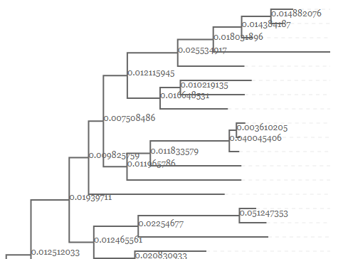
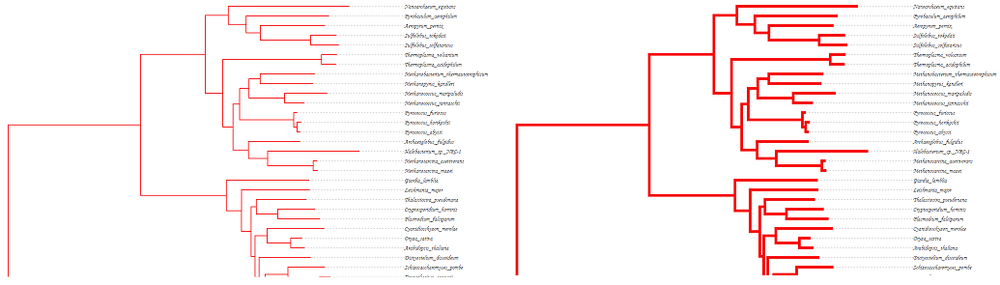
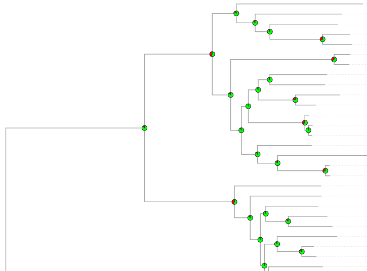
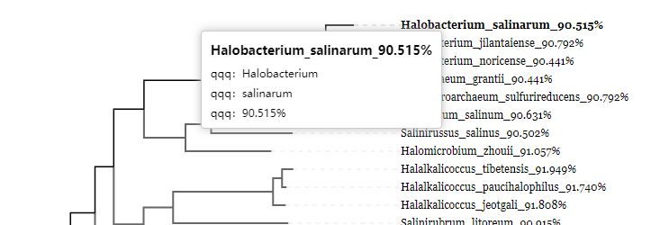
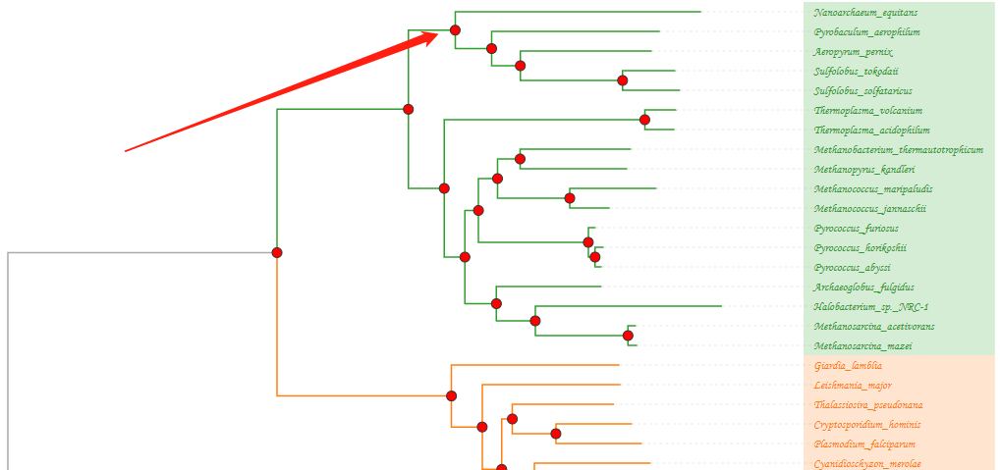
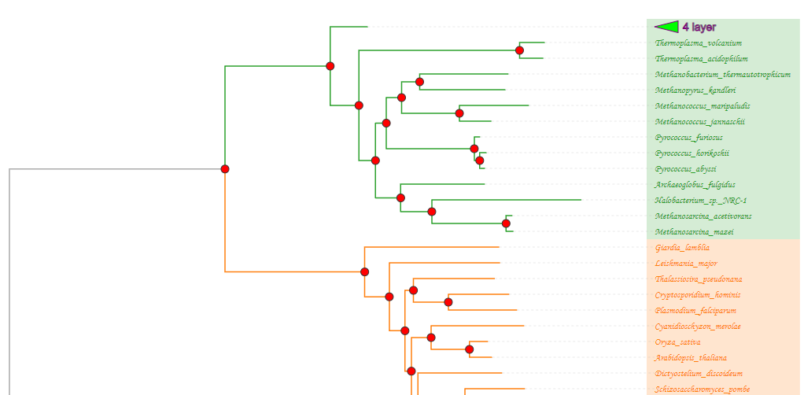
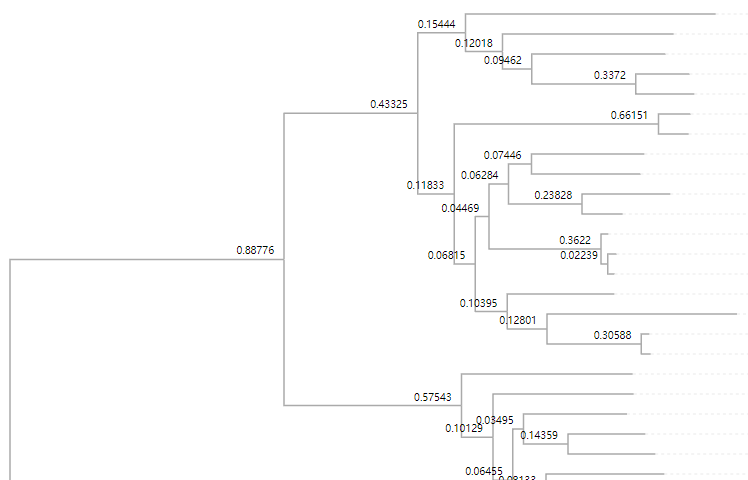
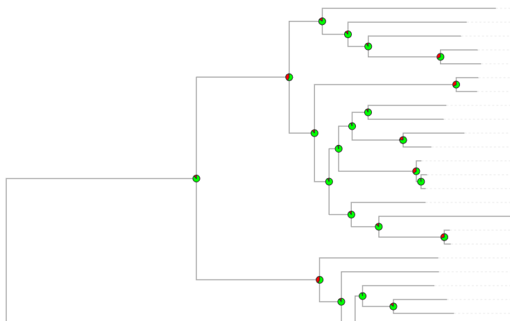

# PhyloScape documentation

## 1 Introduction

### 1.1 About PhyloScape JS library

[PhyloScape](http://www.phyloscape.cc) JS library is based on [d3.js](https://d3js.org) for visualizing phylogenetic trees. PhyloScape supports tree files in Newick format and exports images in SVG and PNG formats. Additionally, PhyloScape supports selecting branches, editing or deleting subtrees, converting tree structures, changing fonts, and displaying metadata.

### 1.2 Quick Use

#### 1.2.1  CDN

The latest version of the PhyloScape library now supports CommonJS and is introduced with a basic label. We recommend linking to a specific version to prevent unexpected disruptions. It is advisable to download PhyloScape for local implementation.

```html
<!-- import PhyloScape online -->
<script src="http://www.darwintree.cn/PhyloScape/phyloscape.main.js"></script>
<script src="http://www.darwintree.cn/PhyloScape/phyloscapeGL.main.js"></script>
```

Examples

Use CND for quick example of tree view:

```html
<!DOCTYPE html>
<html lang="en">

<head>
    <meta charset="UTF-8">
    <meta http-equiv="X-UA-Compatible" content="IE=edge">
    <meta name="viewport" content="width=device-width, initial-scale=1.0">
    <title>phyloscape</title>
</head>

<body>
    <div id="dendrogram"></div>
    <script src="http://www.phyloscape.cc/cdn/phyloscape.main.js"></script>
    <script>
        new phyloscape.InitTreeStructure("#dendrogram", { content: "" })
        // or
        phyloscape.InitTreeLayoutStructure("#dendrogram", {
            content: "",
            layout: "tree"
        })
    </script>
</body>

</html>
```

Use CND for quick example of radial view:
```html
<!DOCTYPE html>
<html lang="en">

<head>
    <meta charset="UTF-8">
    <meta http-equiv="X-UA-Compatible" content="IE=edge">
    <meta name="viewport" content="width=device-width, initial-scale=1.0">
    <title>phyloscape</title>
</head>

<body>
    <div id="dendrogram"></div>
    <script src="http://www.phyloscape.cc/cdn/phyloscape.main.js"></script>
    <script>
        new phyloscape.InitRadialStructure("#dendrogram", { content: "" })
        // or
        phyloscape.InitTreeLayoutStructure("#dendrogram", {
            content: ""
            layout: "radial"
        })
    </script>
</body>

</html>
```

#### 1.2.2  NPM

use npm

```
$ npm install phyloscape --save
```

or global reference

```html
<script type="text/javascript" src="phyloscape.main.js"></script>
<script type="text/javascript" src="phyloscapeGL.main.js"></script>
```

example

```javascript
import phyloscape from "phyloscape";

new phyloscape.InitTreeStructure("#dendrogram", { content: "" })

// or
new phyloscape.InitRadialStructure("#dendrogram", { content: "" })

// or
phyloscape.InitTreeLayoutStructure("#dendrogram", {
    content: ""
    layout: "" // radial、tree
})
```

NPM quote by request
```javascript
import { InitTreeStructure, InitRadialStructure, InitTreeLayoutStructure } from "phyloscape";

new InitTreeStructure("#dendrogram", { content: "" })

// or
new InitRadialStructure("#dendrogram", { content: "" })

// or
InitTreeLayoutStructure("#dendrogram", {
    content: ""
    layout: "" // radial、tree
})
```

## 2 Import/Export

### 2.1 Overview

The PhyloScape JS library supports a wide range of tree file formats. It imports formats such as Newick, Nexus, PhyloXML, and NeXML, and exports to file formats like SVG and PNG.

### 2.2 Import

#### Newick

Newick is a common tree format. The following Newick text represents the tree shown in Figure 2.1

```json
(A:0.1,B:0.2,(C:0.3,D:0.4)E:0.5)F;
```

In the given text，brackets represent internal nodes. For example, `(C:0.3,D:0.4)E:0.5` indicates that node C and node D merge into node E along the branch, where the value after the colon represents the branch length.


<center>Figure 2.1：A simple tree</center>

#### Nexus

Nexus is a popular tree format. Nexus files generally have the extensions `.nxs` or `.nex`. The following Nexus file can be used to represent the tree shown in Figure 2.1.

```
#NEXUS
BEGIN TAXA;
      Dimensions NTax=6;
      TaxLabels A B C D E F;
END;
BEGIN TREES;
      Tree best=(A:0.1,B:0.2,(C:0.3,D:0.4)E:0.5)F;
END;
```

In Nexus files, the first line must start with `#NEXUS`. Additionally, Nexus uses blocks to store data. As shown in the Nexus file structure, each block, such as the **TAXA block**, **DATA block**, and **TREES block**, begins with `BEGIN` and ends with `END`. Among these, the TAXA block is essential. For more detailed information, you can refer to the [NEXUS documentation](http://wiki.christophchamp.com/index.php?title=NEXUS_file_format).

#### PhyloXML

PhyloXML is an XML-based language used to describe phylogenetic trees and related data. The following PhyloXML text can be used to represent the tree shown in Figure 2.1.

```xml
<?xml version="1.0" encoding="UTF-8"?>
<phyloxml xmlns="http://www.phyloxml.org" xmlns:xsi="http://www.w3.org/2001/XMLSchema-instance" xsi:schemaLocation="http://www.phyloxml.org http://www.phyloxml.org/1.00/phyloxml.xsd">
<phylogeny rooted="true">
   <clade>
      <name>F</name>
      <clade branch_length = "0.1">
           <name>A</name>
      </clade>
      <clade branch_length = "0.2">
           <name>B</name>
      </clade>
      <clade branch_length = "0.5">
         <name>E</name>
         <clade branch_length = "0.3">
               <name>C</name>
         </clade>
         <clade branch_length = "0.4">
               <name>D</name>
         </clade>
      </clade>
   </clade>
</phylogeny>
</phyloxml>
```

#### NeXML

NeXML is an XML-based format. The following NeXML file can be used to represent the tree structure shown in Figure 2.1.

```xml
<nex:nexml xmlns:dc="http://purl.org/dc/elements/1.1/" xmlns:xsd="http://www.w3.org/2001/XMLSchema#" xmlns:map="http://phylomap.org/terms.owl#" xmlns="http://www.nexml.org/2009" xmlns:nex="http://www.nexml.org/2009" xmlns:xsi="http://www.w3.org/2001/XMLSchema-instance" xmlns:rdf="http://www.w3.org/1999/02/22-rdf-syntax-ns#" generator="Bio::Phylo::Project v.0.58" version="0.9" xsi:schemaLocation="http://www.nexml.org/2009 http://www.nexml.org/2009/nexml.xsd">
<otus id="os10">
    <otu id="ou11" label="A"/>
    <otu label="B" id="ou12"/>
    <otu label="C" id="ou13"/>
    <otu label="D" id="ou14"/>
</otus>
<trees otus="os10" id="ts2">
    <tree id="te3" xsi:type="nex:FloatTree">
        <node id="ne4" root="true" label="F"/>
        <node id="ne5" otu="ou11" label="A"/>
        <node otu="ou12" label="B" id="ne6"/>
        <node id="ne7" label="E"/>
        <node id="ne8" otu="ou13" label="C"/>
        <node id="ne9" label="D" otu="ou14"/>
        <edge source="ne4" id="edge5" target="ne5" length="0.1"/>
        <edge id="edge6" target="ne6" length="0.2" source="ne4"/>
        <edge id="edge7" target="ne7" length="0.5" source="ne4"/>
        <edge source="ne7" target="ne8" id="edge8" length="0.3"/>
        <edge source="ne7" length="0.4" target="ne9" id="edge9"/>
    </tree>
</trees>
</nex:nexml>
```

[NeXML official website](http://www.nexml.org/) provide many features such as `Nexus->NeXML`, `Newick->NeXML`, `NeXML->json`, `NeXML->rdf`. To get more information about NeXML, you can [click here](https://github.com/nexml/nexml/wiki/NeXML-Manual)

### 2.3 Export

#### SVG

SVG is a vector graphics format that uses XML, ensuring that its image quality remains unaffected when zoomed in. Moreover, SVG files typically have smaller file sizes compared to PNG and JPEG, making them more suitable for network transmission.

#### PNG

PNG is a bitmap format that uses a lossless compression algorithm, allowing for image compression while maintaining image quality and supporting transparency effects.

## 3 Display

### 3.1 Overview

Trees can be visualized with `phyloscape.InitTreeStructure()`, a parameter in `InitTreeStructure` of type `object`, which enable the display or concealment of nodes, adjustment of legend, and styling of branches. For phyloscapeGL.main.js, we integrate the [phylocanvas.gl](https://www.phylocanvas.gl/docs/properties.html), check the link for detail property settings.

### 3.2 Basic settings

The basic settings support the configuration of fundamental elements of the phylogenetic tree, such as node names, support values, branch lengths, leaf area masks, legends, and scroll wheel activation, among others.

#### 3.2.1 Node name/Support value

With the display enabled, the result is shown in Figure 3.1.


<div style="text-align:center">Figure 3.1: displaying node names</div>

#### 3.2.2 Branch length

Branch length is displayed if enabled.



<div style="text-align:center">Figure 3.2: branch length</div>

#### 3.2.3 Sorting

The PhyloScape library supports six sorting methods: default ascending, default descending, length ascending, length descending, name ascending, and name descending.


<div style="text-align:center">Figure 3.3: length ascending/descending</div>


<div style="text-align:center">Figure 3.4: name ascending/descending</div>

#### 3.2.4 Scaling

The PhyloScape library supports scaling operations along the X-axis and Y-axis.


<div style="text-align:center">Figure 3.5: comparison of X-axis scaling</div>


<div style="text-align:center">Figure 3.6 comparison of Y-axis scaling</div>

#### 3.2.5 Mask

When the mask is enabled, the leaf area of the tree displays an opaque mask.


<div style="text-align:center">Figure 3.7: Mask</div>

### 3.3 Styles

PhyloScape library supports legends and allows users to edit the styles of branches, leaves, and nodes.

#### 3.3.1 Legend

The legend feature facilitates regional segmentation and color matching within the area, as shown in Figure 3.8.


<div style="text-align:center">Figure 3.8: legend feature (left is enabled while right is disabled)</div>

#### 3.3.2 Branch style

PhyloScape library allows for the adjustment of branch thickness and color, but if the **legend** feature is enabled, the color adjustment via **branch style** will not work.



<div style="text-align:center">Figure 3.9: phylogenetic tree with different styles</div>

It is also possible to edit the dashed line, as shown in figure 3.10.


<div style="text-align:center">Figure 3.10: dashed lines</div>

#### 3.3.3 Branch type

Three branch types are supported in PhyloScape.main.js: elbow, smooth and straight (shown in Figure 3.10). 


<div style="text-align:center">Figure 3.11: elbow, smooth and straight</div>

#### 3.3.4 Leaf style

PhyloScape library enables the customization of font, font color, and font size for the leaf node labels. However, enabling the **legend** feature will overwrite the color customization, leading to ineffective color changes.


<div style="text-align:center">Figure 3.12: phylogenetic trees with different branch and leaf styles</div>

#### 3.3.5 Node style

The node supports styles of pie charts and circles, as shown in Figure 3.13-3.15.



<div style="text-align:center">Figure 3.13: pie chart</div>


<div style="text-align:center">Figure 3.14: filled circle</div>


<div style="text-align:center">Figure 3.15: empty circle</div>

### 3.4 Metadata

Metadata settings include tooltips and signs.

#### 3.4.1 Tooltips

Hovering the mouse over a leaf node name will display tooltips, as shown in Figure 3.12.



<div style="text-align:center">Figure 3.16: tooltips</div>

#### 3.4.2 Signs

Bars, pies and other sign are supported.


<div style="text-align:center">Figure 3.17: signs</div>

### 3.5 Branch optimization

The library offers the capability to display branch lengths using different scales, allowing for distinct scales among branches within the same tree to enhance clarity in distinguishing between branches.


<div style="text-align:center">Figure 3.18: Multi scale display of branch length（<div style="color:blue">blue</div> is expanded to 10 times the original length, <div style="color:red">red</div> is expanded to 10 times the original length）</div>

## 4 Operations

### 4.1 Overview

PhyloScape offers support for a variety of visual operations, including node and branch selection, tree structure transformations, and graphic area dragging.

### 4.2 Scaling and dragging

Scaling and dragging are supported in PhyloScape.


<div style="text-align:center">Figure 4.1: Scaling and dragging</div>

### 4.3 Tree topology

PhyloScape library provides options for displaying phylogenetic trees in both rectangular and circular views.


<div style="text-align:center">Figure 4.2: rectangular</div>


<div style="text-align:center">Figure 4.3: circular</div>

### 4.4 Shortcuts

This library supports marking subtree branches, editing subtrees, flipping subtrees, resetting trees, exporting selected branches, and downloading Newick structures.


<div style="text-align:center">Figure 4.4: right click a node shows a menu</div>


<div style="text-align:center">Figure 4.5: right click a white area show a different menu</div>

## 5 Configuration

The configuration file is shown in Figure 5.1, and its usage is as follows:


<div style="text-align:center">Figure 5.1: content is the config object</div>

### content

`string`

The PhyloScape library supports the Newick format. The following code illustrates a tree, as shown in Figure 2.1.

```json
content: "(A:0.1,B:0.2,(C:0.3,D:0.4)E:0.5)F";
```

### width

`number`

Set the canvas width to 1600 by default. If the value is too small, the tree will not be fully displayed.


<div style="text-align:center">Figure 5.2: width comparison</div>

### height

`number`

Set the height of the canvas. If the value is too small, the tree structure will not be fully displayed.

### sort

`string`

Set the sorting method for the tree structure. There are six optional sorting methods: **defaultAsc**, **defaultDes**, **nameAsc**, **nameDes**, **lengthAsc**, and **lengthDes**. Here, **defaultAsc** and **defaultDes** sort according to the level of the node. The result of the following code is shown in Figure 5.4.

```json
sort = "nameDes"
```


<div style="text-align:center">Figure 5.3: nodes are arranged in descending name order</div>

### size

`array`

No more than 2 values, where size[0] controls the horizontal stretching of the canvas, size[1] controls the width of the canvas, and size[1] is optional, as shown below:

```json
# Horizontal stretch value 800, canvas width 400
size = [800, 400]
# The horizontal stretch value is 400, and the canvas width equals with width
size = [400]
```


<div style="text-align:center">Figure 5.4: lateral stretch comparison</div>

### position

`array`

Control the left and top margin, as shown in Figure 5.5:

```json
// The left margin is 20 and the top margin is 100
position=[20, 100]
```


<div style="text-align:center">Figure 5.5：position comparison</div>

### separation

`number`
Adjust the longitudinal stretch value in the range [0,20]. The higher the value, the longer the longitudinal displayed of the tree.

```json
// The longitudinal stretch value is set to 10
position = 10
```


<div style="text-align:center">Figure 5.6: longitudinal comparison</div>

### scale

`number`

The larger the overall stretch ratio, the greater the width and height of the phylogenetic tree.

```json
// The longitudinal stretch value is set to 10
scale = 1.2
```


<div style="text-align:center">Figure 5.7: scale comparison</div>

### stretch

 `object`

stretch.show： `boolean` , enable stretch.

stretch.data： `boolean` , range and scales.

Here is an example:

```json
// branches which length in [0.001,0.003),[0.003,0.005) and [0.005,0.008) will be expanded by 1, 2, 3 times respectively.
stretch: {
    "show": true,
    "data": [
        {
            "range": [
                0.001,
                0.003
            ],
            "multiple": 1,
            "color": "red"
        },
        {
            "range": [
                0.003,
                0.005
            ],
            "multiple": 2,
            "color": "blue"
        },
        {
            "range": [
                0.005,
                0.008
            ],
            "multiple": 3,
            "color": "green"
        }
    ]
}
```


<div style="text-align:center">Figure 5.8: branch optimization</div>

### isCollapsible

`boolean`

Whether or not to allow the subtree to collapse. If enabled, users can click on any inner node to collapse the subtree, as shown in Figures 5.9 and 5.10.

```json
// Collapse feature is enabled
isCollapsible = true
```



<div style="text-align:center">Figure 5.9: click node to collapse the subtree</div>



<div style="text-align:center">Figure 5.10: folding</div>

To unfold subtree, users can click the triangle symbol.


<div style="text-align:center">Figure 5.11: unfold subtree</div>

### isPhylogram

`boolean`

If set to true, all leaf branches will be right-aligned; otherwise, the branches will be displayed with their actual branch lengths. This is illustrated in Figures 5.12 and 5.13.


<div style="text-align:center">Figure 5.12：isPhylogram=true, align all leaf branches to the right</div>


<div style="text-align:center">Figure 5.13：isPhylogram=false, showing branches with branch length</div>

### isWheelZoom

`boolean`

If true, wheel scaling and phylogenetic tree dragging feature will be enabled 


<div style="text-align:center">Figure 5.14: slide the scroll wheel to zoom phylogenetic tree, and click to drag the screen</div>

### style

`object`

The global text style of the canvas, which can be overwritten with other styles.

style["font-family"]：`string` type, which is used to set the font-family, can be null, and it can be set to the following optional values`["Aria"、"Georgia"、"Verdana"、"Courier"、"Courier New"、"Times New Roman"、"Impact、Monotype Corsiva"]`，

style.fill：`string` type, is used to set color of the filled shape

style["font-size"]：`string` type, is used to set the font size

The result of following code is shown in Figure 5.15.

```json
// Set the font set to Monotype Corsiva and fill it with red color. The font size is 10px
style = {
	'font-family': "Arial",
	'fill': 'red',
    'font-size': "10px",
}
```


<div style="text-align:center">Figure 5.15: global font style</div>

### leafs

`object`

This is used to control the display of leafs area. The subparameters are shown as follows:

leafs.show：`boolean` type, leaves area will show if true value is set

leafs.dx： `number` type, horizontal offset of leaves area

leafs.dy：`number` type, vertical offset of leaves area

leafs.style：`object` type, text style of the leaves area

leafs.formatter：`function` type, which is a callback function, the parameter selection is an instance returned by d3.select, while data is another parameter containing data with each individual leaf node.

Result of the following code is shown in Figure 5.16.

```json
leafs = {
	show: true,
	dx: 0,
	dy: 0,
	style: {
        // Font is filled with blue
		fill: 'blue',
		// Note that this should be of type number and cannot be written as "12px", which is different from the style in other places
		'font-size': 12,
		'font-family': "Monotype Corsiva"
	},
    // Callback function
	formatter: function (select, data) {
        // If the branch length is greater than 0.5, then set the label size to 20px and set color to red
        if (data.data.length > 0.5) {
        	select.attr("font-size", "20px")
        	select.attr("fill", "red")
        }
	}
}
```


<div style="text-align:center">Figure 5.16: leaf node style</div>

### extension

`object`

Controls properties of dashed lines.

```json
extension = {
    // The default value is true. If set false, the phylogenetic tree will be hidden
	show: true,
    // Dashed line style
	style: {
		stroke: '#aaa',
		'stroke-dasharray': 3,
		'stroke-width': 1,
	}
}
```

### mask

`object`

It is used to control the leaf node mask. The subparameters are shown as follows.

mask.show：`boolean` type, show mask on leaves

mask.dx： `number` type, horizontal offset of the mask

mask.dy：`number` type, vertical offset of the mask

mask.padding：`array` type, paddings of the mask

mask.style：`object` type, style of the mask

```json
mask = {
	show: true,
	dx: 0,
	dy: 0,
	padding: [10, 10],
	style: {
		opacity: 0.2
	}
}
```


<div style="text-align:center">Figure 5.17: leaf node mask styles</div>

### nodes

`object`

Properties of the nodes, sub properties are shown as follows:

nodes.value：`object`,  style of bootstrap values

nodes.collapse：`object`, style of triangular symbols

nodes.name：`object`, style of node names

nodes.shape：`object`, style of node shapes

```json
// This code relates to figure 5.18
nodes.value = {
	show: false,
    // Horizontal offset
	dx: -10,
    // Vertical offset
    dy: -5,
    style: {
    	"text-anchor": 'end',
        fill: '#000',
        'font-size': 10,
        'font-family': "sans-serif",
    },
    // Callback function
    formatter: function (select, data) {}
}
```



<div style="text-align:center">Figure 5.18: bootstrap value</div>

```json
// This code relates to figure 5.19
nodes.collapse = {
    // Horizontal offset of the triangular symbol
	dx: 0,
    // Vertical offset of the triangular symbol
    dy: 0,
    // Rotation angle of the triangular symbol, if greater than 0 then shows clockwise rotation angle, else less than 0 then shows counterclockwise rotation angle
    rotate: 0,
    // Width and height of triangular symbol
    size: [30, 15],
    style: {
    	fill: 'lime',
        stroke: 'purple',
        'stroke-width': 1,
        cursor: 'pointer'
    },
    // Callback function
    formatter: function (select, data) {}
}
```


<div style="text-align:center">Figure 5.19: triangular fold symbol to the right</div>

```json
// This code relates to figure 5.20
nodes.name = {
    show: false,
    dx: 10,
    dy: 3,
    style: {
       "text-anchor": 'start',
       fill: '#000',
       'font-size': 10,
       'font-family': "sans-serif"
    },
    formatter: function (select, data) {}
}
```


<div style="text-align:center">Figure 5.20: node names</div>

```json
// This code relates to figure 5.21-5.23
nodes.shape = {
    // Two optional value are supported: pie, circle
    type: 'pie',
    dx: 0,
	dy: 0,
    style: {
		"stroke-width": 1,
        fill: 'rgb(255, 120, 57)',
        stroke: "#333",
        cursor: 'pointer'
    },
    // type is set to circle
    circle: {
        // radius
    	r: 5,
        style: {
        	fill: 'red'
    	},
        // Callback function
        formatter: function (select, data) {}
    },
    // type is set to pie
    pie: {
        color: ['rgb(0, 255, 0)', 'red'],
        innerRadius: 0,
        outerRadius: 5,
        style: {},
        // Callback function
        formatter: function (select, data) {}
    }
}
```



<div style="text-align:center">Figure 5.21: node type is set to pie</div>


<div style="text-align:center">Figure 5.22: node type is set to circle</div>


<div style="text-align:center">Figure 5.23: node style not displayed when node type is set to empty</div>

### links

`object`

Display branch style.

```json
// This code relates to the elbow diagram in Figure 5.24
links = {
	// The branch type can be set as elbow, smooth and line, representing elbow, smooth curve and straight line respectively
	type: 'elbow', 
	style: {},
	formatter: function (select, data) {}
}
```


<div style="text-align:center">Figure 5.24: elbow, smooth, line</div>

### legend

`object`

Display the legend

```json
// This code relates to figure 5.25
legend = {
	show: true,
    dx: 50,
    dy: 30,
    // Internal vertical spacing of the legend
    spacing: 10,
    style: {
        'font-size': 12,
        fill: '#333',
        'font-family': ''
    },
    // rect area
    rect: {
    	width: 40,
        height: 20,
        dx: -1400,
        dy: 0,
        style: {},
    },
    // text area
    text: {
        width: 20,
        height: 20,
        dx: -1400,
        dy: 0,
        style: {
            'text-anchor': "end"
        },
        formatter: function (select, text) {
            return text
        }
    },
    // Controls the rendering of the colors of all branch areas under the corresponding node
    data: [
    	{
        	name: "A",
            color: "#1f77b4"
        }, {
            name: "B",
            color: "#ff7f0e"
        }, {
            name: "E",
            color: "#2ca02c"
        }
    ]
}
```


<div style="text-align:center">Figure 5.25: legend</div>

### tooltips

 `object`

tooltips.show： `boolean` , show tooltips if set true

tooltips.data： `object` , specific data

```json
// This code relates to tooltips
tooltip: {
    "show": true,
    "data": {
        "Halobacterium_salinarum_90.515%": [
            {
                "label": "qqq",
                "value": "Halobacterium"
            },
            {
                "label": "qqq",
                "value": "salinarum"
            },
            {
                "label": "qqq",
                "value": "90.515%"
            }
        ]
    }
}
```


<div style="text-align:center">Figure 5.26: tooltips</div>

You can set the hyperlink corresponding to the `value` by using the `href` attribute, for example:
```json
    {
        "label": "qqq",
        "value": "Halobacterium",
        "href": "https://www.ncbi.nlm.nih.gov/Taxonomy/Browser/wwwtax.cgi?mode=Tree&id=2239&lvl=3&keep=1&srchmode=1&unlock"
    },
```

### sign

`object`

Display signs. The sub attributes are as follows:

sign.show：`boolean`, show signs

sign.dx：`number`, horizontal offset

sign.dy：`number`, vertical offset

sign.data：`array`,  set shape of signs and mapping them on leaves. 

By setting the type of each element in sign.data.data, the display of thermal, circular, rectangular, rectangular, rectangular, text, Y, cross, prismatic, triangular, star, pie, histogram, custom image, etc. can be supported

The following code can be mapped to the tree structure shown in Figure 2.1 to display the heat sign.

```json
// Map to the tree structure shown in Figure 2.1 and set the sign map as heat sign, corresponding to Figure 5.27
sign = {
    show:true,
    dx:10,
    dy:0,
    data: [
        {
            label: { 
                spacing: 40,
            },
            data:{
                "A": {"type": "heatmap","data":[{"name":"ht1","style":{"font-size":"12px"}},{"name":"ht2","style":{"fill":"red","font-size":"12px"}},{"name":"ht3","style":{"fill":"green","font-size":"12px"}}]},
                "B": {"type": "heatmap","data":[{"name":"ht1","style":{"font-size":"12px"}},{"name":"ht2","style":{"fill":"yellow","font-size":"12px"}},{"name":"ht3","style":{"fill":"green","font-size":"12px"}}]},
                "C": {"type": "heatmap","data":[{"name":"ht1","style":{"font-size":"12px"}},{"name":"ht2","style":{"fill":"red","font-size":"12px"}},{"name":"ht3","style":{"fill":"green","font-size":"12px"}}]},
                "D": {"type": "heatmap","data":[{"name":"ht1","style":{"font-size":"12px"}},{"name":"ht2","style":{"fill":"red","font-size":"12px"}},{"name":"ht3","style":{"fill":"green","font-size":"12px"}}]},
                "E": {"type": "heatmap","data":[{"name":"ht1","style":{"font-size":"12px"}},{"name":"ht2","style":{"fill":"#ff0000","font-size":"12px"}},{"name":"ht3","style":{"fill":"green","font-size":"12px"}}]}
            }
        }
    ]
}
```


<div style="text-align:center">Figure 5.27: heat sign</div>

```json
// Map to the tree structure shown in Figure 2.1, and set the sign to circle, corresponding to Figure 5.28
sign = {
    show:true,
    dx:10,
    dy:0,
    data: [
        {
            label : { 
                name: "circular shape",
                spacing: 40
            },
            data:{
                "A": {"type":"circle","name":"circle_1","size":1,"style":{"fill":"#00ff00"}},
                "B": {"type":"circle","name":"circle_1","size":1,"style":{"fill":"#ff0000"}},
                "C": {"type":"circle","name":"circle_1","size":1,"style":{"fill":"#0000ff"}},
                "D": {"type":"circle","name":"circle_1","size":1,"style":{"fill":"#ffff00"}},
                "E": {"type":"circle","name":"circle_1","size":1,"style":{"fill":"#0000ff"}}
            }
        }
    ]
}
```


<div style="text-align:center">Figure 5.28: Circular sign</div>

```json
// Map to the tree structure shown in Figure 2.1 and set the sign to rectangle, corresponding to Figure 5.29
sign = {
    show:true,
    dx:10,
    dy:0,
    data: [
        {
            label : {
                name: "rectangular shape",
                spacing: 40
            },
            data:{
                "A": {"type":"rectangle","name":"rectangle","style":{"fill":"rgb(247, 190, 129)"}},
                "B": {"type":"rectangle","name":"rectangle","style":{"fill":"rgb(247, 190, 129)"}},
                "C": {"type":"rectangle","name":"rectangle","style":{"fill":"rgb(247, 190, 129)"}},
                "D": {"type":"rectangle","name":"rectangle","style":{"fill":"rgb(247, 190, 129)"}},
                "E": {"type":"rectangle","name":"rectangle","style":{"fill":"rgb(247, 190, 129)"}}
            }
        }
    ]
}
```


<div style="text-align:center">Figure 5.29: rectangular sign</div>


```json
// Map to the tree structure shown in Figure 2.1, and set the flag to rect, corresponding to Figure 5.30
sign = {
    show:true,
    dx:10,
    dy:0,
    data: [
        {
            label : { 
                name: "rect sign",
                spacing: 40
            },
            data:{
                "A": {"type":"rect","name":"rect","size":1,"style":{"fill":"#ff0000"}},
                "B": {"type":"rect","name":"rect","size":1,"style":{"fill":"#00ff00"}},
                "C": {"type":"rect","name":"rect","size":1,"style":{"fill":"#0000ff"}},
                "D": {"type":"rect","name":"rect","size":1,"style":{"fill":"#ffff00"}},
                "E": {"type":"rect","name":"rect","size":1,"style":{"fill":"#00ffff"}}
            }
        }
    ]
}
```


<div style="text-align:center">Figure 5.30: rect sign</div>

```json
// Map to the tree structure shown in Figure 2.1, and set the sign to text, corresponding to Figure 5.31
sign = {
    show:true,
    dx:10,
    dy:0,
    data: [
        {
            label : { 
                name: "text sign",
                spacing: 40
            },
            data:{
                "A": {"type":"text","name":"Q"},
                "B": {"type":"text","name":"C"},
                "C": {"type":"text","name":"E"},
                "D": {"type":"text","name":"R"},
                "E": {"type":"text","name":"T"}
            }
        }
    ]
}
```


<div style="text-align:center">Figure 5.31: text sign</div>

```json
// Map to the tree structure shown in Figure 2.1, and set the sign to Y-shape, corresponding to Figure 5.32
sign = {
    show:true,
    dx:10,
    dy:0,
    data: [
        {
            label : { 
                name: "Y-shaped sign",
                spacing: 40
            },
            data:{
                "A": {"type":"wye","name":"wye","style":{"fill":"#ff0000"}},
                "B": {"type":"wye","name":"wye","style":{"fill":"#00ff00"}},
                "C": {"type":"wye","name":"wye","style":{"fill":"#0000ff"}},
                "D": {"type":"wye","name":"wye","style":{"fill":"#ffff00"}},
                "E": {"type":"wye","name":"wye","style":{"fill":"#00ffff"}}
            }
        }
    ]
}
```


<div style="text-align:center">Figure 5.32: Y-shaped sign</div>

```json
// Map to the tree structure shown in Figure 2.1, and set the sign to cross, corresponding to Figure 5.33
sign = {
    show:true,
    dx:10,
    dy:0,
    data: [
        {
            label : { 
                name: "cross sign",
                spacing: 40
            },
            data:{
                "A": {"type":"cross","name":"cross","style":{"fill":"#ff0000"}},
                "B": {"type":"cross","name":"cross","style":{"fill":"#00ff00"}},
                "C": {"type":"cross","name":"cross","style":{"fill":"#0000ff"}},
                "D": {"type":"cross","name":"cross","style":{"fill":"#ffff00"}},
                "E": {"type":"cross","name":"cross","style":{"fill":"#00ffff"}}
            }
        }
    ]
}
```


<div style="text-align:center">Figure 5.33: cross sign</div>

```json
// Map to the tree structure shown in Figure 2.1, and set the sign is set to prism, corresponding to Figure 5.34
sign = {
    show:true,
    dx:10,
    dy:0,
    data: [
        {
            label : { 
                name: "prism sign",
                spacing: 40
            },
            data:{
                "A": {"type":"diamond","name":"diamond","style":{"fill":"#ff0000"}},
                "B": {"type":"diamond","name":"diamond","style":{"fill":"#00ff00"}},
                "C": {"type":"diamond","name":"diamond","style":{"fill":"#0000ff"}},
                "D": {"type":"diamond","name":"diamond","style":{"fill":"#ffff00"}},
                "E": {"type":"diamond","name":"diamond","style":{"fill":"#00ffff"}}
            }
        }
    ]
}
```


<div style="text-align:center">Figure 5.34: prism sign</div>

```json
// Map to the tree structure shown in Figure 2.1, and set the sign to triangular, corresponding to figure 5.35
sign = {
    show:true,
    dx:10,
    dy:0,
    data: [
        {
            label : { 
                name: "triangular sign",
                spacing: 40
            },
            data:{
                "A": {"type":"triangle","name":"triangle","style":{"fill":"#ff0000"}},
                "B": {"type":"triangle","name":"triangle","style":{"fill":"#00ff00"}},
                "C": {"type":"triangle","name":"triangle","style":{"fill":"#0000ff"}},
                "D": {"type":"triangle","name":"triangle","style":{"fill":"#ffff00"}},
                "E": {"type":"triangle","name":"triangle","style":{"fill":"#00ffff"}}
            }
        }
    ]
}
```


<div style="text-align:center">Figure 5.35: triangular sign</div>

```json
// Map to the tree structure shown in Figure 2.1 and set the sign to star, corresponding to Figure 5.36
sign = {
    show:true,
    dx:10,
    dy:0,
    data: [
        {
            label : { 
                name: "star sign",
                spacing: 40
            },
            data:{
                "A": {"type":"star","name":"star","style":{"fill":"#ff0000"}},
                "B": {"type":"star","name":"star","style":{"fill":"#00ff00"}},
                "C": {"type":"star","name":"star","style":{"fill":"#0000ff"}},
                "D": {"type":"star","name":"star","style":{"fill":"#ffff00"}},
                "E": {"type":"star","name":"star","style":{"fill":"#00ffff"}}
            }
        }
    ]
}
```


<div style="text-align:center">Figure 5.36: star sign</div>

```json
// Map to the tree structure shown in Figure 2.1 and set the sign to pie-shaped sign, corresponding to Figure 5.37
sign = {
    show:true,
    dx:10,
    dy:0,
    data: [
        {
            label : { 
                name: "pie-shaped sign",
                spacing: 40
            },
            data:{
                "A": {"type":"pie","name":"pie","data":[{"name":"gene1","value":1,"style":{"fill":"red","font-size":"12px"}},{"name":"gene2","value":1,"style":{"fill":"green","font-size":"12px"}},{"name":"gene3","value":1,"style":{"fill":"blue","font-size":"12px"}}]},
                "B": {"type":"pie","name":"pie","data":[{"name":"gene1","value":2,"style":{"fill":"red","font-size":"12px"}},{"name":"gene2","value":2,"style":{"fill":"green","font-size":"12px"}},{"name":"gene3","value":2,"style":{"fill":"blue","font-size":"12px"}}]},
                "C": {"type":"pie","name":"pie","data":[{"name":"gene1","value":1,"style":{"fill":"red","font-size":"12px"}},{"name":"gene2","value":2,"style":{"fill":"green","font-size":"12px"}},{"name":"gene3","value":3,"style":{"fill":"blue","font-size":"12px"}}]},
                "D": {"type":"pie","name":"pie","data":[{"name":"gene1","value":1,"style":{"fill":"red","font-size":"12px"}},{"name":"gene2","value":2,"style":{"fill":"green","font-size":"12px"}},{"name":"gene3","value":2,"style":{"fill":"blue","font-size":"12px"}}]},
                "E": {"type":"pie","name":"pie","data":[{"name":"gene1","value":1,"style":{"fill":"red","font-size":"12px"}},{"name":"gene2","value":2,"style":{"fill":"green","font-size":"12px"}},{"name":"gene3","value":2,"style":{"fill":"blue","font-size":"12px"}}]}
            }
        }
    ]
}
```


<div style="text-align:center">Figure 5.37: pie-shaped sign</div>

```json
// Map to the tree structure shown in Figure 2.1, and set the sign to histogram, corresponding to Figure 5.38
sign = {
    show:true,
    dx:10,
    dy:0,
    data: [
        {
            label : { 
                name: "histogram",
                spacing: 40
            },
            data:{
                "A": {"type":"bar","name":"pie","data":[{"name":"gene1","value":10,"style":{"fill":"red",       "font-size":"12px"}},{"name":"gene2","value":10,"style":{"fill":"green","font-size":"12px"}},{"name":"gene3","value":10,"style":{"fill":"blue","font-size":"12px"}}]},
                "B": {"type":"bar","name":"pie","data":[{"name":"gene1","value":20,"style":{"fill":"red",       "font-size":"12px"}},{"name":"gene2","value":20,"style":{"fill":"green","font-size":"12px"}},{"name":"gene3","value":20,"style":{"fill":"blue","font-size":"12px"}}]},
                "C": {"type":"bar","name":"pie","data":[{"name":"gene1","value":10,"style":{"fill":"red",       "font-size":"12px"}},{"name":"gene2","value":20,"style":{"fill":"green","font-size":"12px"}},{"name":"gene3","value":30,"style":{"fill":"blue","font-size":"12px"}}]},
                "D": {"type":"bar","name":"pie","data":[{"name":"gene1","value":10,"style":{"fill":"red",       "font-size":"12px"}},{"name":"gene2","value":20,"style":{"fill":"green","font-size":"12px"}},{"name":"gene3","value":20,"style":{"fill":"blue","font-size":"12px"}}]},
                "E": {"type":"bar","name":"pie","data":[{"name":"gene1","value":10,"style":{"fill":"red",       "font-size":"12px"}},{"name":"gene2","value":20,"style":{"fill":"green","font-size":"12px"}},{"name":"gene3","value":20,"style":{"fill":"blue","font-size":"12px"}}]}
            }
        }
    ]
}
```


<div style="text-align:center">Figure 5.38: histogram</div>

```json
// Set the sign to a customized picture, as shown in Figure 5.39.
sign: {
    show: true,
    dx: 10,
    dy: 0,
    data: [
        {
            label: {
                name: "Cutomized picture",
                spacing: 40
            },
            "data": {
                "A": {
                    "type": "image",
                    "show": true,
                    "name": "phyloscape",
                    "href": "./logo.png",
                    "rotate": 0,
                    "dx": 0
                }
            }
        }
    ]
}
```


<div style="text-align:center">Figure 5.39: cutomized picture</div>

